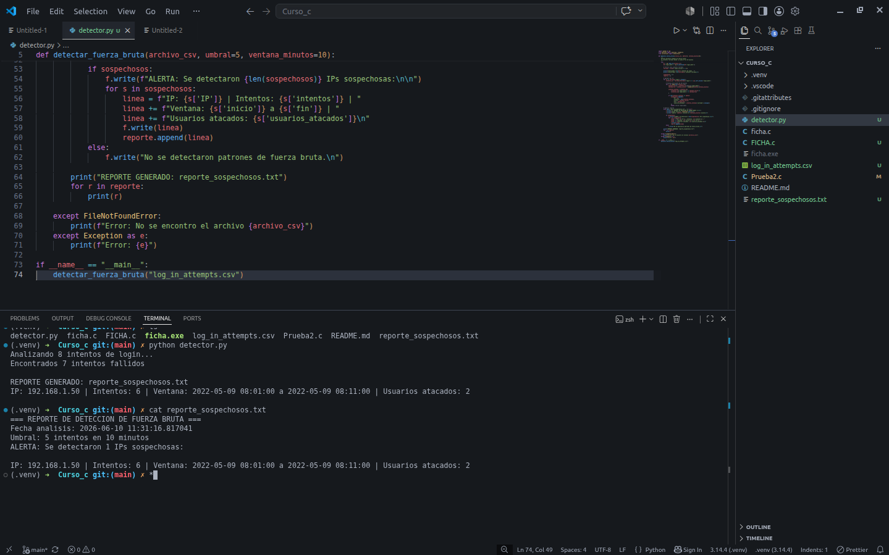
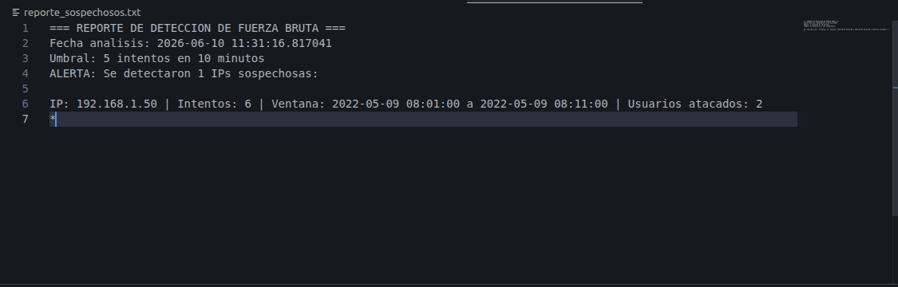

# Brute Force Detector

Script en Python que analiza logs de login y detecta ataques de fuerza bruta.

## Qué hace
Busca +5 intentos fallidos desde la misma IP en 10 minutos usando Pandas.

## Cómo usarlo
```bash
python detector.py
## Evidencias

### Captura 1: Ejecución del script en terminal


### Captura 2: Contenido del reporte generado  

